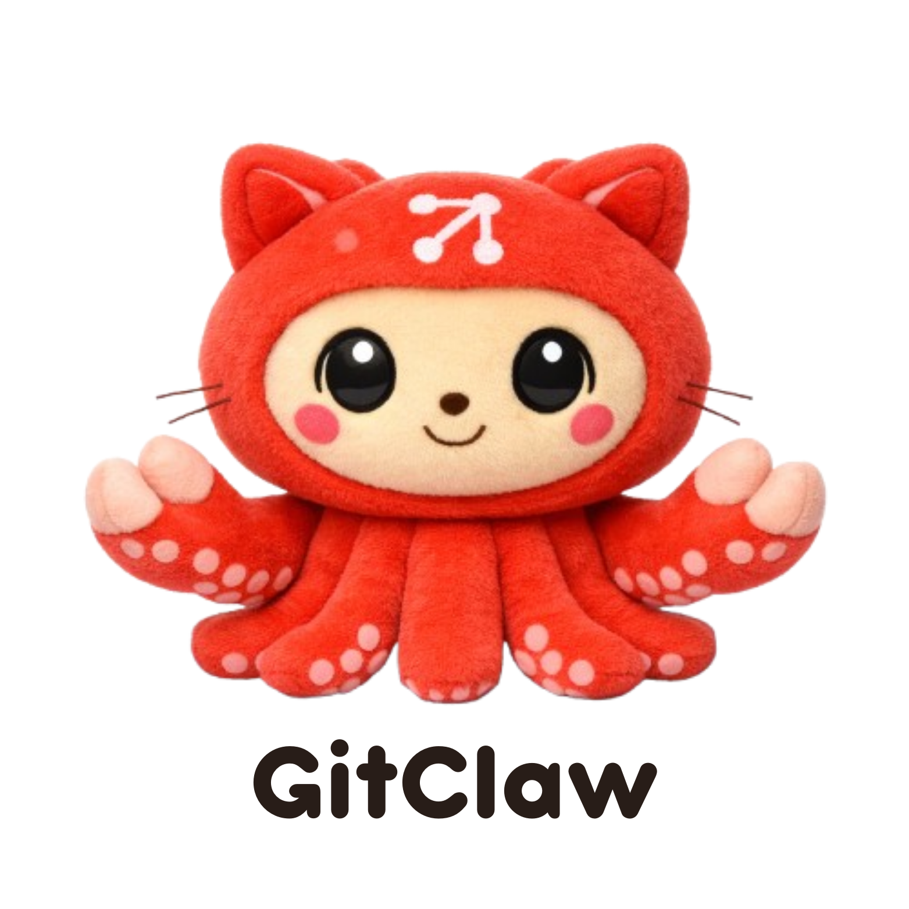

<p align="center">
  
</p>

<p align="center">
  
  
  
  
  
</p>

<h1 align="center">Rusty GitClaw</h1>

<p align="center">
  <strong>A universal git-native AI agent framework — written in Rust.</strong><br/>
  Your agent lives inside a git repo — identity, rules, memory, tools, and skills are all version-controlled files.<br/>
  Single binary. Zero runtime dependencies. Blazing fast.
</p>

<p align="center">
  <a href="#quick-start">Quick Start</a> &bull;
  <a href="#sdk">SDK</a> &bull;
  <a href="#architecture">Architecture</a> &bull;
  <a href="#tools">Tools</a> &bull;
  <a href="#hooks">Hooks</a> &bull;
  <a href="#skills">Skills</a> &bull;
  <a href="#voice-mode">Voice</a>
</p>

---

## Why Rusty GitClaw?

This is the **Rust port** of [GitClaw](https://github.com/open-gitagent/gitclaw) — same agent-as-a-repo philosophy, same CLI flags, same `agent.yaml` format, but compiled to a single 12MB binary with no runtime dependencies.

**Your agent IS a git repository:**

- **`agent.yaml`** — model, tools, runtime config
- **`SOUL.md`** — personality and identity
- **`RULES.md`** — behavioral constraints
- **`memory/`** — git-committed memory with full history
- **`tools/`** — declarative YAML tool definitions
- **`skills/`** — composable skill modules
- **`hooks/`** — lifecycle hooks (script-based)

Fork an agent. Branch a personality. `git log` your agent's memory. Diff its rules. This is **agents as repos**.

### Why Rust?

| | TypeScript (gitclaw) | Rust (rusty-gitclaw) |
|---|---|---|
| **Install** | `npm install -g gitclaw` | Single binary, no runtime |
| **Startup** | ~500ms (Node.js boot) | ~5ms |
| **Binary** | 50MB+ (node_modules) | 12MB |
| **Memory** | ~80MB baseline | ~8MB baseline |
| **Dependencies** | Node.js 20+ | None |

## Install

### From source

```bash
git clone https://github.com/open-gitagent/rusty-gitclaw.git
cd rusty-gitclaw
cargo install --path gitclaw
```

### From crates.io (coming soon)

```bash
cargo install gitclaw
```

### Pre-built binaries

Check [Releases](https://github.com/open-gitagent/rusty-gitclaw/releases) for pre-built binaries for macOS, Linux, and Windows.

## Quick Start

**Run your first agent in one line:**

```bash
export OPENAI_API_KEY="sk-..."
gitclaw --dir ~/my-project --prompt "Explain this project and suggest improvements"
```

That's it. Gitclaw auto-scaffolds everything on first run — `agent.yaml`, `SOUL.md`, `memory/` — and drops you into the agent.

**Interactive REPL mode:**

```bash
export ANTHROPIC_API_KEY="sk-..."
gitclaw --dir ~/my-project --model anthropic:claude-sonnet-4-5-20250929
```

### Local Repo Mode

Clone a GitHub repo, run an agent on it, auto-commit and push to a session branch:

```bash
gitclaw --repo https://github.com/org/repo --pat ghp_xxx --prompt "Fix the login bug"
```

Resume an existing session:

```bash
gitclaw --repo https://github.com/org/repo --pat ghp_xxx --session gitclaw/session-a1b2c3d4 --prompt "Continue"
```

Token can come from env instead of `--pat`:

```bash
export GITHUB_TOKEN=ghp_xxx
gitclaw --repo https://github.com/org/repo --prompt "Add unit tests"
```

### Voice Mode

Talk to your agent using OpenAI's Realtime API:

```bash
export OPENAI_API_KEY="sk-..."
gitclaw --dir ~/my-project --voice
# Health check: curl localhost:3333/health
```

### CLI Options

| Flag | Short | Description |
|---|---|---|
| `--dir <path>` | `-d` | Agent directory (default: cwd) |
| `--repo <url>` | `-r` | GitHub repo URL to clone and work on |
| `--pat <token>` | | GitHub PAT (or set `GITHUB_TOKEN` / `GIT_TOKEN`) |
| `--session <branch>` | | Resume an existing session branch |
| `--model <provider:model>` | `-m` | Override model (e.g. `anthropic:claude-sonnet-4-5-20250929`) |
| `--sandbox` | `-s` | Run in sandbox VM (coming soon) |
| `--prompt <text>` | `-p` | Single-shot prompt (skip REPL) |
| `--env <name>` | `-e` | Environment config |
| `--voice` | `-v` | Enable voice mode (requires `OPENAI_API_KEY`) |

## SDK

Use Rusty GitClaw as a library in your Rust projects:

```toml
# Cargo.toml
[dependencies]
gitclaw = { git = "https://github.com/open-gitagent/rusty-gitclaw" }
tokio = { version = "1", features = ["full"] }
```

```rust
use gitclaw::{query, QueryOptions};

#[tokio::main]
async fn main() {
    let mut q = query(QueryOptions {
        prompt: "List all Rust files and summarize them".to_string(),
        dir: Some("./my-agent".to_string()),
        model: Some("openai:gpt-4o-mini".to_string()),
        ..Default::default()
    });

    while let Some(msg) = q.next().await {
        match msg {
            gitclaw::GCMessage::Delta(d) => eprint!("{}", d.content),
            gitclaw::GCMessage::Assistant(a) => {
                eprintln!("\n\nDone. Model: {}", a.model);
            }
            gitclaw::GCMessage::ToolUse(t) => {
                eprintln!("[tool] {}(..)", t.tool_name);
            }
            gitclaw::GCMessage::System(s) => {
                eprintln!("[{}] {}", s.subtype, s.content);
            }
            _ => {}
        }
    }
}
```

## Architecture

```
my-agent/
├── agent.yaml          # Model, tools, runtime config
├── SOUL.md             # Agent identity & personality
├── RULES.md            # Behavioral rules & constraints
├── DUTIES.md           # Role-specific responsibilities
├── memory/
│   └── MEMORY.md       # Git-committed agent memory
├── tools/
│   └── *.yaml          # Declarative tool definitions
├── skills/
│   └── <name>/
│       ├── SKILL.md    # Skill instructions (YAML frontmatter)
│       └── scripts/    # Skill scripts
├── workflows/
│   └── *.yaml|*.md     # Multi-step workflow definitions
├── agents/
│   └── <name>/         # Sub-agent definitions
├── hooks/
│   └── hooks.yaml      # Lifecycle hook scripts
├── knowledge/
│   └── index.yaml      # Knowledge base entries
├── config/
│   ├── default.yaml    # Default environment config
│   └── <env>.yaml      # Environment overrides
├── examples/
│   └── *.md            # Few-shot examples
└── compliance/
    └── *.yaml          # Compliance & audit config
```

### Workspace Structure

Rusty GitClaw is built as a Rust workspace with three crates:

```
rusty-gitclaw/
├── pi-ai/              # LLM provider abstraction (Anthropic, OpenAI, Google)
├── pi-agent-core/      # Agent loop engine (tool execution, events, cancellation)
└── gitclaw/            # CLI + SDK + tools + voice
```

### Agent Manifest (`agent.yaml`)

```yaml
spec_version: "0.1.0"
name: my-agent
version: 1.0.0
description: An agent that does things

model:
  preferred: "anthropic:claude-sonnet-4-5-20250929"
  fallback: ["openai:gpt-4o"]
  constraints:
    temperature: 0.7
    max_tokens: 4096

tools: [cli, read, write, memory]

runtime:
  max_turns: 50
  timeout: 120

# Optional
extends: "https://github.com/org/base-agent.git"
skills: [code-review, deploy]
delegation:
  mode: auto
compliance:
  risk_level: medium
  human_in_the_loop: true
```

## Tools

### Built-in Tools

| Tool | Description |
|---|---|
| `cli` | Execute shell commands with timeout |
| `read` | Read files with pagination and binary detection |
| `write` | Write/create files with auto directory creation |
| `memory` | Load/save git-committed memory with full history |

### Declarative Tools

Define tools as YAML in `tools/`:

```yaml
# tools/search.yaml
name: search
description: Search the codebase
input_schema:
  properties:
    query:
      type: string
      description: Search query
    path:
      type: string
      description: Directory to search
  required: [query]
implementation:
  script: search.sh
  runtime: sh
```

The script receives args as JSON on stdin and returns output on stdout.

## Hooks

Script-based hooks in `hooks/hooks.yaml`:

```yaml
hooks:
  on_session_start:
    - script: validate-env.sh
      description: Check environment is ready
  pre_tool_use:
    - script: audit-tools.sh
      description: Log and gate tool usage
  post_response:
    - script: notify.sh
  on_error:
    - script: alert.sh
```

Hook scripts receive context as JSON on stdin and return:

```json
{ "action": "allow" }
{ "action": "block", "reason": "Not permitted" }
{ "action": "modify", "args": { "modified": "args" } }
```

## Skills

Skills are composable instruction modules in `skills/<name>/`:

```
skills/
  code-review/
    SKILL.md
    scripts/
      lint.sh
```

```markdown
---
name: code-review
description: Review code for quality and security
---

# Code Review

When reviewing code:
1. Check for security vulnerabilities
2. Verify error handling
3. Run the lint script for style checks
```

Invoke via REPL: `/skill:code-review Review the auth module`

## Multi-Model Support

Rusty GitClaw ships with a built-in registry of **383 models** across 8 providers:

| Provider | Example Models |
|---|---|
| `anthropic` | `claude-sonnet-4-5-20250929`, `claude-haiku-3-5-20241022` |
| `openai` | `gpt-4o`, `gpt-4o-mini`, `o1`, `o3-mini` |
| `google` | `gemini-2.0-flash`, `gemini-1.5-pro` |
| `xai` | `grok-2`, `grok-beta` |
| `groq` | `llama-3.3-70b-versatile` |
| `mistral` | `mistral-large-latest` |
| `openrouter` | 200+ models |
| `cerebras` | `llama-3.3-70b` |

```yaml
# agent.yaml
model:
  preferred: "anthropic:claude-sonnet-4-5-20250929"
  fallback:
    - "openai:gpt-4o"
    - "google:gemini-2.0-flash"
```

## Compliance & Audit

Built-in compliance validation and audit logging:

```yaml
# agent.yaml
compliance:
  risk_level: high
  human_in_the_loop: true
  data_classification: confidential
  regulatory_frameworks: [SOC2, GDPR]
  recordkeeping:
    audit_logging: true
    retention_days: 90
```

Audit logs are written to `.gitagent/audit.jsonl` with full tool invocation traces.

## Compatibility

Rusty GitClaw is **fully compatible** with the [TypeScript GitClaw](https://github.com/open-gitagent/gitclaw):

- Same `agent.yaml` format
- Same directory structure
- Same CLI flags
- Same tool behavior
- Same hook protocol
- Same skill format

You can switch between the TypeScript and Rust versions without changing your agent repo.

## Contributing

Contributions are welcome! Please see [CONTRIBUTING.md](./CONTRIBUTING.md) for guidelines.

## License

This project is licensed under the [MIT License](./LICENSE).

## Acknowledgments

- [GitClaw](https://github.com/open-gitagent/gitclaw) — the original TypeScript implementation
- [pi-ai](https://github.com/nicepkg/pi-ai) / [pi-agent-core](https://github.com/nicepkg/pi-agent-core) — the LLM abstraction layer this is built on
